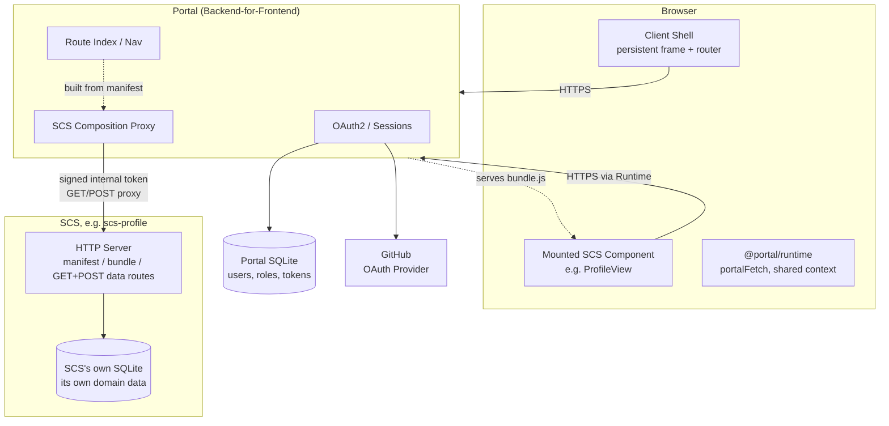
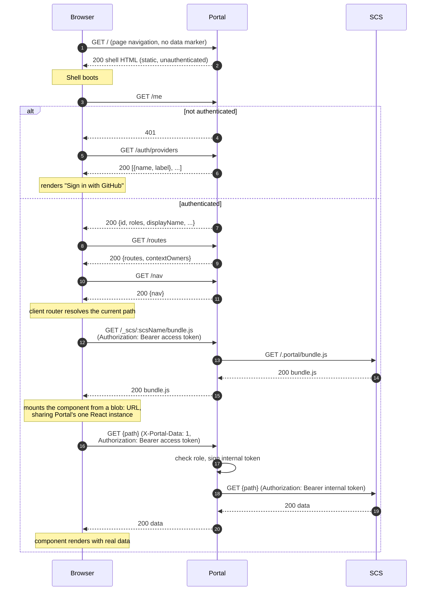

# Getting Started

Portal is a Bun/TypeScript backend-for-frontend. See `specification.md`
for the architecture; this document only covers getting a local
instance running. Building a self-contained system (SCS) that plugs into
Portal is a separate concern — see
[`docs/scs-contributor-guide.md`](docs/scs-contributor-guide.md).

## Architecture at a glance

Three kinds of process, always talking through Portal — the browser never
reaches an SCS directly, and an SCS never reaches the browser directly:



And how a page actually loads, from the first request to a mounted
component rendering with real data:



## Prerequisites

- [Bun](https://bun.sh) (developed against 1.3.x)
- A GitHub account, to register an OAuth App (see below)

## 1. Install dependencies

```bash
bun install
```

## 2. Register a GitHub OAuth App

Portal never owns user credentials — it authenticates via OAuth2
against external providers, selected explicitly by the user ("Sign in
with GitHub"). GitHub is currently the only configured provider
(`src/auth/providers.ts`).

1. Go to GitHub → Settings → Developer settings → OAuth Apps → **New
   OAuth App**.
2. Homepage URL: `http://localhost:3000`
3. Authorization callback URL: `http://localhost:3000/auth/callback/github`
   (must match exactly — Portal builds this from `PORTAL_BASE_URL`, or
   the incoming request's own origin if that's unset, plus
   `/auth/callback/<provider>`).
4. Register the app, then generate a client secret.

Without this, `/auth/login/github` redirects back to Portal's own
`#error=oauth_failed` screen instead of GitHub — Portal now fails fast
here rather than forwarding a request with an empty `client_id` on to
GitHub (which used to come back as a confusing 404 on GitHub's own
site).

### Adding another provider later

`getProviders()` in `src/auth/providers.ts` returns a
`Record<string, OAuthProviderConfig>` keyed by provider name. To add
one, add another entry with its `authorizeUrl`/`tokenUrl`/
`userInfoUrl`/`scope`/`mapProfile`, and read its credentials from
`<PROVIDER_NAME>_CLIENT_ID` / `<PROVIDER_NAME>_CLIENT_SECRET` — that
env var naming convention is what the boot-time credential check
(`warnOnMissingProviderCredentials` in `src/server.ts`) assumes when it
warns about a misconfigured provider.

## 3. Configure environment variables

Environment variables are loaded from a per-environment file via
Bun's built-in `--env-file` flag (already wired into the `dev` and
`start:prod` npm scripts — no dotenv dependency). `.env.*` is
git-ignored, so these files stay local. Shell-style `export KEY=value`
lines work fine (Bun's parser tolerates the `export` prefix), so the
same file can also be `source`d directly if you want the vars in your
own shell.

Create `.env.dev` for local development:

```bash
export GITHUB_CLIENT_ID=<client id from step 2>
export GITHUB_CLIENT_SECRET=<client secret from step 2>
```

Full list of variables Portal reads:

| Variable | Required? | Purpose |
|---|---|---|
| `GITHUB_CLIENT_ID` / `GITHUB_CLIENT_SECRET` | Needed for GitHub sign-in to work | OAuth App credentials from step 2. Missing → boot-time warning + `/auth/login/github` fails with a clear redirect instead of reaching GitHub. |
| `NODE_ENV` | No | `"production"` enables strict mode: missing signing secrets throw at boot instead of warning, and the OAuth state cookie is marked `Secure`. Anything else behaves as development. |
| `ACCESS_TOKEN_SECRET` | Required in production | Signs access tokens. Outside production, falls back to an insecure hardcoded dev default with a warning. |
| `STATE_SECRET` | Required in production | Signs the OAuth CSRF state parameter. Same fallback behavior as `ACCESS_TOKEN_SECRET`. |
| `INTERNAL_TOKEN_SECRET` | Required in production, only if `PORTAL_SCS_URLS` is set | Signs internal service-to-service tokens for SCS bundle/manifest fetches. Not resolved at all when no manifest registry is configured. |
| `DATABASE_PATH` | No | SQLite file path. Defaults to `portal.sqlite` in the working directory. |
| `PORT` | No | Server port. Defaults to `3000`. |
| `PORTAL_BASE_URL` | No | Overrides the base URL used to build OAuth redirect/callback URIs. Defaults to the incoming request's own origin. Set this if Portal runs behind a reverse proxy or a different public hostname. |
| `PORTAL_ADMIN_EMAILS` | No | Comma-separated list of emails auto-granted the `portal:admin` role on first login. Empty → no user is auto-promoted to admin. |
| `PORTAL_SCS_URLS` | No | Comma-separated base URLs of registered self-contained systems. Empty → no manifest registry, so nav/route enforcement/SCS bundle loading are all disabled. |

## 4. Run the dev server

```bash
bun run dev
```

This loads `.env.dev`, watches for file changes, and serves at
**`http://localhost:3000`**. `bunfig.toml`'s `[serve]` section doesn't
set `https` — that section only applies to Bun's built-in static-file
dev server anyway, not to `src/server.ts`'s direct `Bun.serve()` call —
and the code already accounts for plain HTTP locally (the OAuth state
cookie is only marked `Secure` when `NODE_ENV=production`).

## 5. Run tests and type-check

```bash
bun test
bun run typecheck
```

## 6. Production

```bash
bun run start:prod
```

Sets `NODE_ENV=production` and loads `.env.production` (create it the
same way as `.env.dev`, with real secrets — production refuses to boot
with the insecure dev defaults for `ACCESS_TOKEN_SECRET`/
`STATE_SECRET`/`INTERNAL_TOKEN_SECRET`).
